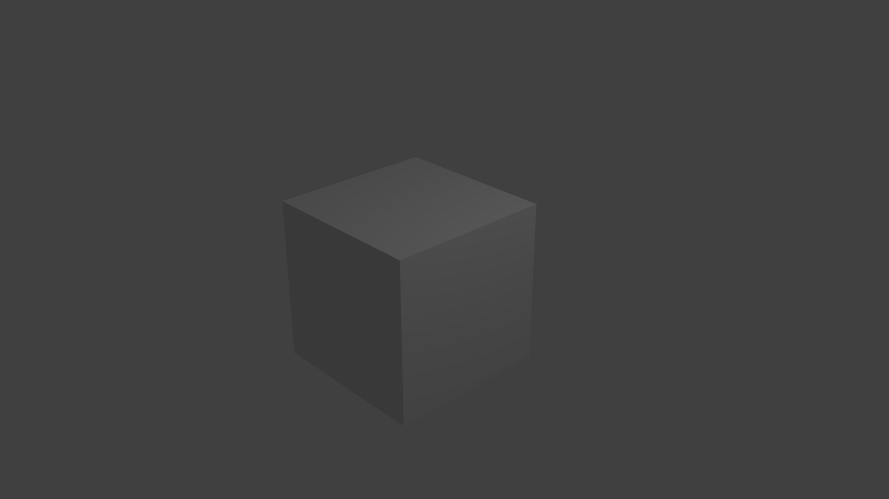
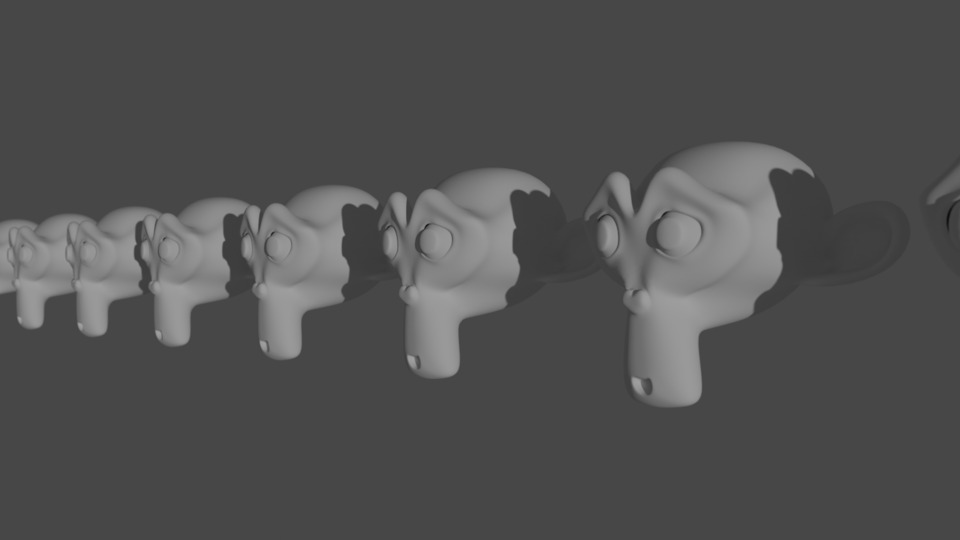
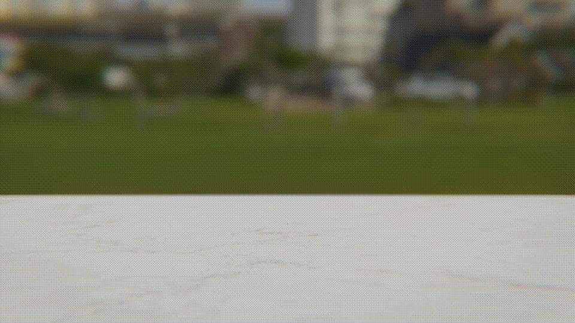
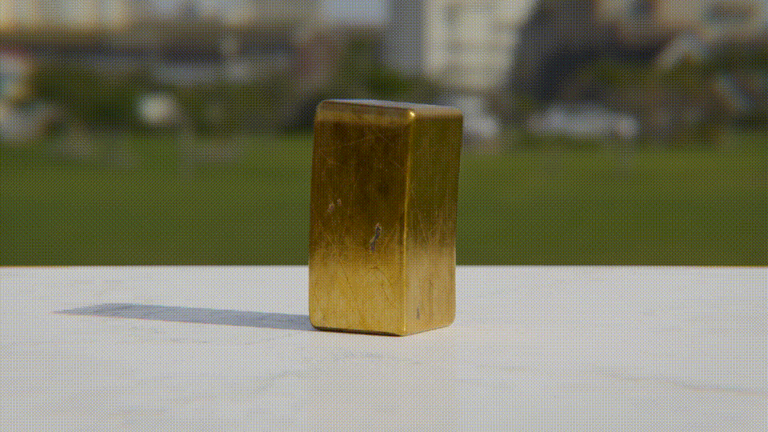
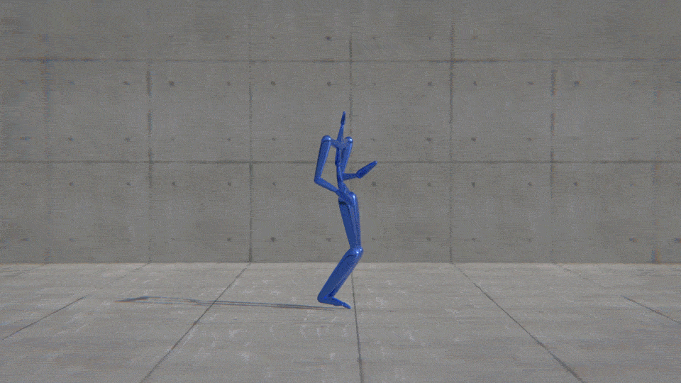
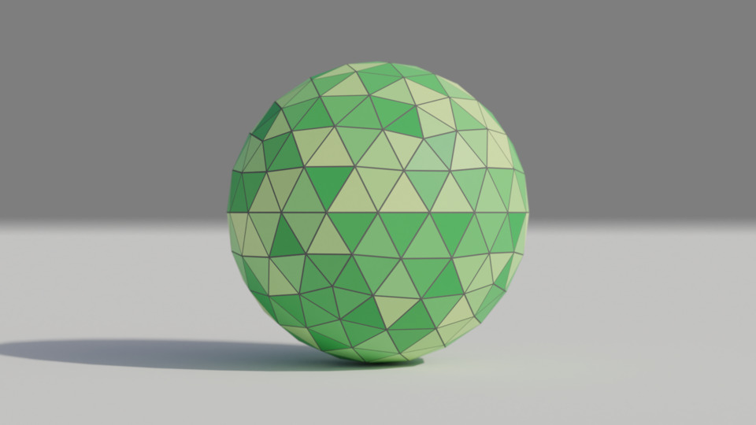

# blender-cli-rendering

Python scripts for rendering images using Blender from command-line interface.

## Principles

- Able to run without display
- Designed for non-Blender users
- Based on Blender 2.79

## Possible Usages

- Visualization of 3D data with fancy rendering quality.
- Generation of synthetic training datasets for machine learning-based computer vision.

## Scripts

### 01_cube.py

- Cycles renderer



### 02_suzanne.py

- Directional light
- Algorithmic object placement
- Subdivision surfaces
- `TRACK_TO` constraint to achieve camera's _look-at_ behavior
- Depth of field



### 03_ibl.py

- Node-tree
- Image-based lighting using an HDR image


### 04_principled_bsdf.py

- Principled BSDF
- Denoising
- Empty object as a target


### 05_composition.py

- Composition
- Glare
- Lens distortion
- Chromatic aberration


### 06_vignette.py

- Vignette
- Color correction
- Node group
- Automatic arrangement of nodes in the node editor


### 07_texturing.py

- Image texture
- UV calculation


### 08_animation.py

- Keyframing
- Motion blur



### 09_armature.py

- Skeletal animation
- Skinning



### 10_mocap.py

- Mesh creation from Python data
- BVH data import
- Texture tiling
- Camera following



### 11_mesh_visualization.py

- Wireframe
- Vertex colors
- Transparent background



### 12_split_tone.py

- Split Tone


## For Docker Users

Thanks to the fact that Blender can run on Linux without displays as a command line tool, it is straightforward to run all the above scripts using Docker.
```
git clone https://github.com/yuki-koyama/blender-cli-rendering.git
cd blender-cli-rendering
docker build -t blender-cli-rendering .
docker run -v /absolute/path/to/output/directory:/home/out blender-cli-rendering
```
Note that it is necessary to replace `/absolute/path/to/output/directory` with an appropriate path.

## License

Scripts in this repository use the Blender Python API, which is licensed under GNU General Public License (GPL). Thus, these scripts are considered as derivative works of a GPL-licensed work, so they are also licensed under GPL following the copyleft rule.
