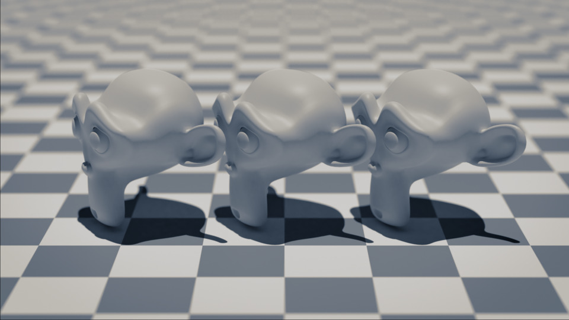
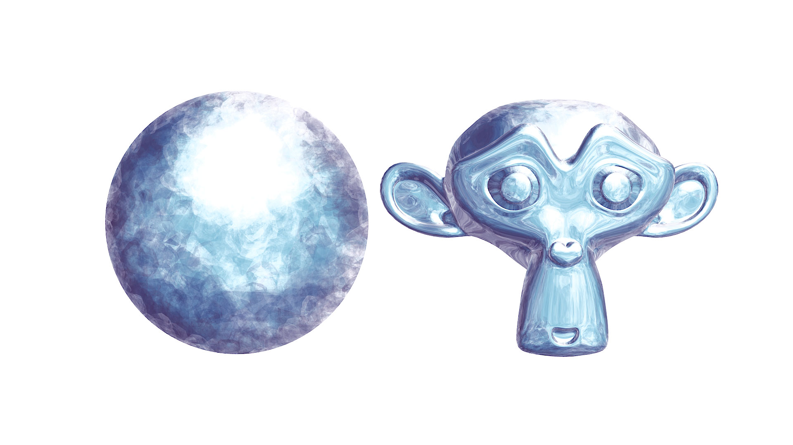
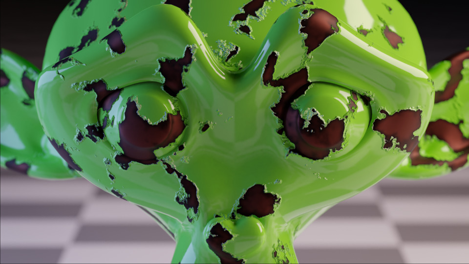

# blender-cli-rendering

Python scripts for generating scenes and rendering images using Blender from command-line interface.

## Principles

- Able to run without display (thus, the renderer should be Cycles instead of EEVEE)
- Support the latest Blender release (currently 2.83)

## Possible Usages

- Material to learn how to use Blender Python APIs.
- Visualization of 3D data with fancy rendering quality.
- Generation of synthetic training datasets for machine learning-based computer vision.

## Scripts

### 01_cube.py

- Cycles renderer

### 02_suzanne.py

- Directional light
- Algorithmic object placement
- Subdivision surfaces
- `TRACK_TO` constraint to achieve camera's _look-at_ behavior
- Depth of field
- Smooth shading

### 03_ibl.py

- Node-tree
- Image-based lighting using an HDR image

### 04_principled_bsdf.py

- Principled BSDF
- Denoising
- Empty object as a target

### 05_composition.py

- Composition nodes
- Node group

### 06_split_tone.py

- Split tone effect
- Checker board texture

### 07_texturing.py

- Image texture

### 08_animation.py

- Keyframing
- Motion blur

### 09_armature.py

- Skeletal animation
- Skinning

### 10_mocap.py

- Mesh creation from Python data
- BVH data import
- Texture tiling
- Camera following

### 11_mesh_visualization.py

- Wireframe
- Vertex colors
- Transparent background

### 12_cloth.py

- Cloth modifier
- Collision modifier
- Area light

### 13_matcap.py

- MatCap (a.k.a. Lit Sphere)
- Image filtering (e.g., sharpen)
- Simple RGB background
- Node frame

### 14_procedural_texturing.py

- Noise texture

## License

Scripts in this repository use the Blender Python API, which is licensed under GNU General Public License (GPL). Thus, these scripts are considered as derivative works of a GPL-licensed work, so they are also licensed under GPL following the copyleft rule.
